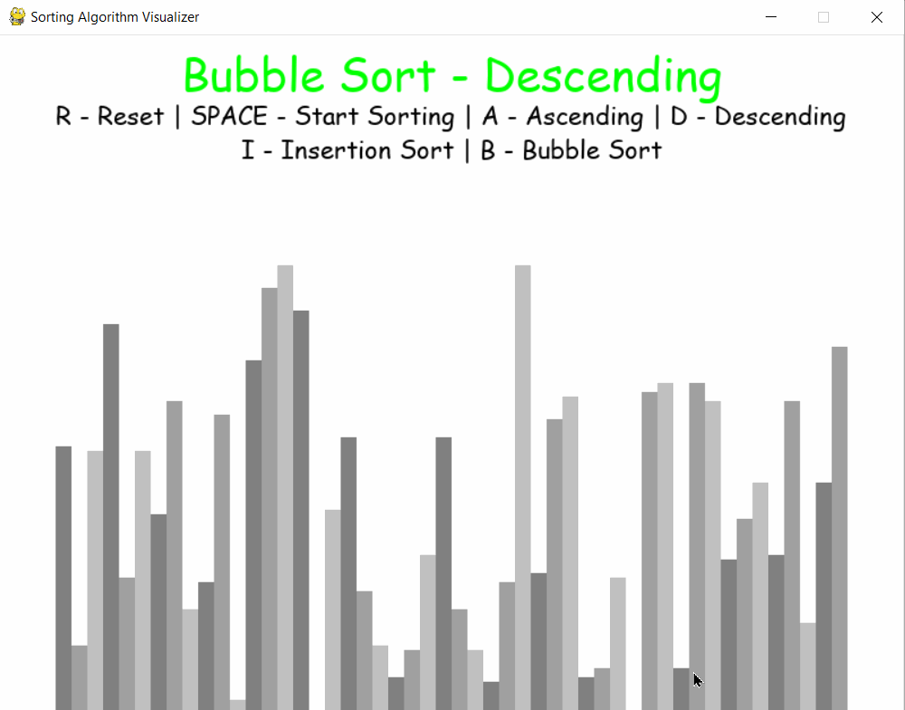
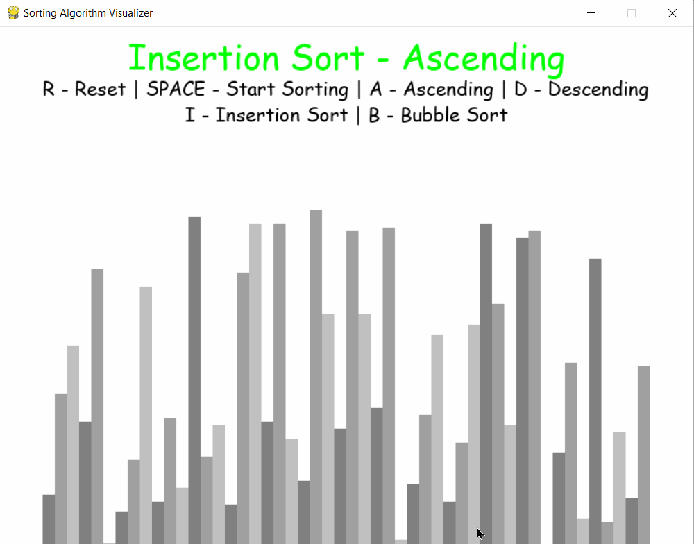

# Sorting-Algorithms-Visualizer

I have created a sorting algorithms visualizer using Python and PyGame module.
User can see Bubble Sort and Insertion Sort in ascending as well as descending  by simply running this main.py file.

## Bubble Sort Algorithm

## Insertion Sort Algorithm

